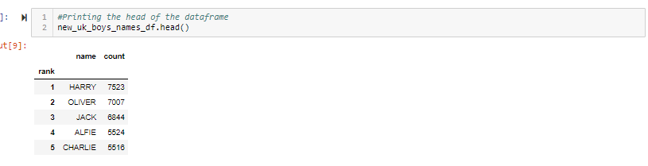
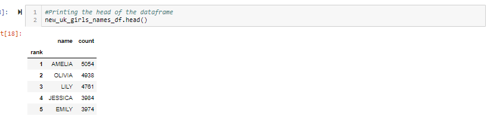
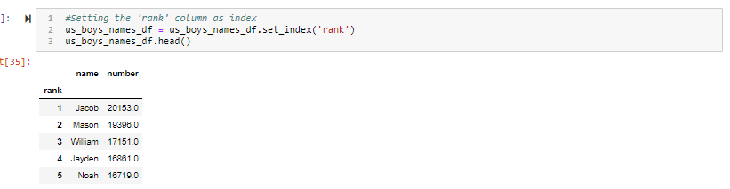

?#Baby Names [ETL]

I completed this project during my time at the [Columbia Engineering Data Analytics Bootcamp](https://bootcamp.cvn.columbia.edu/data/nyc/landing/?s=Google-Brand&pkw=%2Bdata%20%2Banalytics%20%2Bcolumbia&pcrid=392444639754&pmt=b&utm_source=google&utm_medium=cpc&utm_campaign=%5BS%5D_GRD_Data_Brand_ALL_NYC_BMM_New&utm_term=%2Bdata%20%2Banalytics%20%2Bcolumbia&utm_content=392444639754&s=google&k=%2Bdata%20%2Banalytics%20%2Bcolumbia&gclid=Cj0KCQiA2b7uBRDsARIsAEE9XpFH-2wU0-_7jtxCV_PCkGBR0prlyKtvpF2-nAWU1tO4oYci5h1QStsaAsg5EALw_wcB&gclsrc=aw.ds) located in New York, NY.

#### -- Project Status: [Completed]

## Project Description
In this project, the data was collected from Kaggle, UK Office for National Statistics and US Census Bureau as CSVs, cleaned and loaded it to Postgres. 

### EXTRACT
The data was pulled from UK Office for National Statistics and US Census Bureau as CSV files.

### TRANSFORM: 
##### Cleaning UK Girls & Boys DataSets
- Imported the data sets as CSV
- Created a dataframe
- To get rid of empty columns, selected the desired columns by making a copy of the dataframe and calling the columns 
- Used lower case titles in order to match the Postgres tables by using a .rename function  
- Set ‘rank’ as an index to remove Pandas automatic index to avoid Postgres index conflict
- To turn the ‘count’ column into integers, used str.replace to get rid of commas within the numerical values 
- Used a pd.numeric function to turn the ‘count’ column  strings into integers
- Used .loc function to locate duplicate values in the rank column  such a  rank 68 
-Repeated the same exercise for all of UK girls dataset except rank 88 was listed twice

##### Cleaning US Girls & Boys DataSets
- Imported datasets as CSVs
- Created a dataframe
- Dropped any blank cells using dropna
- Used lower case titles in order to match the Postgres tables by using a .rename function. 
- Set ‘rank’ as an index to remove Pandas automatic index to avoid Postgres index conflict
- Repeated the same exercise for all US girls data sets

### LOAD:

Postgres was used as it is a relational database. Given the fact that the data was in tables consisting of rows & columns, it was the best way to handle the data. 

## Partner 

Ashley Peterson 

## Technologies
* Python (Pandas, Matplotlib, SqLAlchemy, Jupyter Notebook)
* SQL (Postgres)

## Methods Used
* ETL
* Data Cleaning
* Database

## Output 

##### Data Engineering 
* UK_Boys_Names [rank - name - count]

* UK_Girls_Names [rank - name - count]

* US_Boys_Names [rank - name - number]

* US_Girls_Names [rank - name - number]

## Get Started

1. Clone this repository (for help see this [tutorial](https://help.github.com/articles/cloning-a-repository/)).
2. Find the CSVs from  the [datasets](https://github.com/CarolineDelva/ETL-Team-Project/tree/master/datasets) folder.

3. Find the script to create tables as [query.sql](https://github.com/CarolineDelva/ETL-Team-Project/blob/master/query.sql).
4. Find the ETL script in the [Analysis](https://github.com/CarolineDelva/ETL-Team-Project/tree/master/Analysis) folder.
5. Run the script for each model in their own [Jupyter Notebook](https://jupyter.org/).

## Contact
* [Visit my LinkedIn](https://www.linkedin.com/in/caroline-delva-5184a172/) 
* [Visit my portfolio](https://carolinedelva.github.io/CarolineDelvaPortfolio/) 
